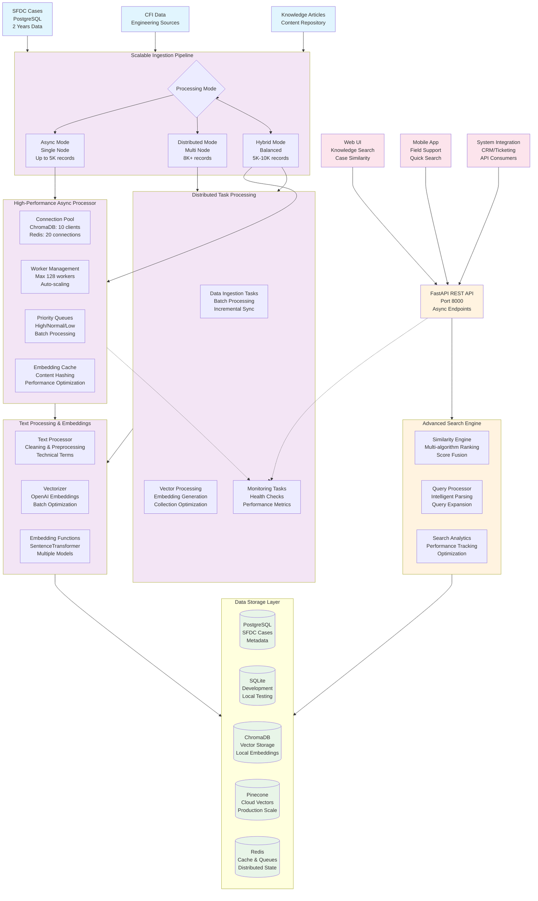
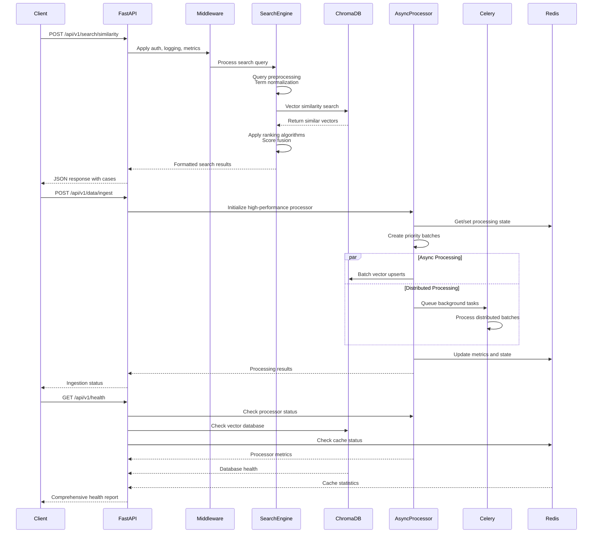
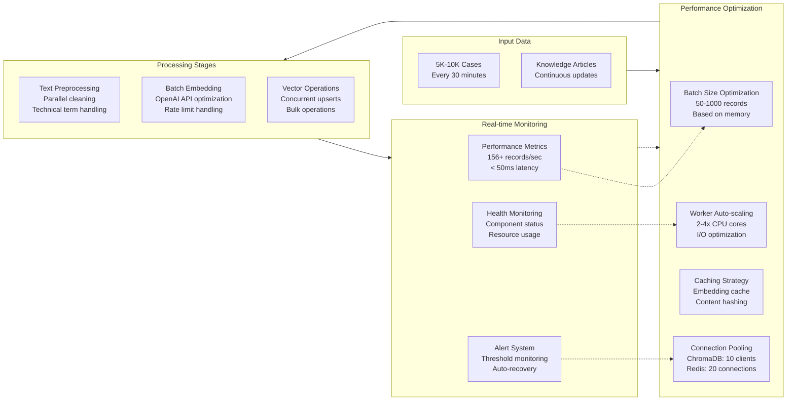
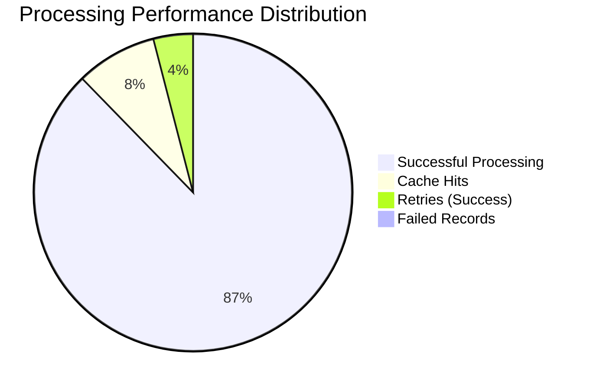
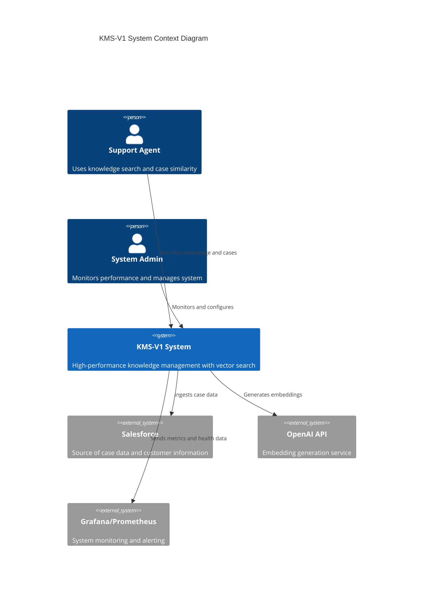

# KMS-V1 System Flow Diagram

## High-Level Architecture Flow



## Detailed Async Processing Flow

```mermaid
flowchart TD
    START([Data Ingestion Request]) --> INIT[Initialize High-Performance Processor]
    
    INIT --> CONFIG{Configure Processing Mode}
    CONFIG -->|< 5K records| ASYNC[Async Mode<br/>32 workers, 200 batch]
    CONFIG -->|5K-10K records| HYBRID[Hybrid Mode<br/>64 workers, 500 batch]
    CONFIG -->|> 10K records| DIST[Distributed Mode<br/>128 workers, 1000 batch]
    
    %% Async Processing Path
    ASYNC --> POOL_INIT[Initialize Connection Pool<br/>ChromaDB: 10 clients<br/>Redis: 20 connections]
    POOL_INIT --> EXTRACT[Extract Data<br/>SQLite/PostgreSQL<br/>Cases & Knowledge]
    
    EXTRACT --> BATCH[Create Processing Batches<br/>Configurable batch size<br/>Priority assignment]
    BATCH --> QUEUE[Add to Priority Queues<br/>High/Normal/Low<br/>Worker distribution]
    
    %% Worker Processing
    QUEUE --> WORKER{Available Worker?}
    WORKER -->|Yes| PROCESS[Process Batch<br/>Text preprocessing<br/>Embedding generation]
    WORKER -->|No| WAIT[Wait in Queue<br/>Priority-based scheduling]
    WAIT --> WORKER
    
    %% Processing Steps
    PROCESS --> HASH_CHECK[Content Hash Check<br/>Change detection<br/>Skip unchanged]
    HASH_CHECK -->|Changed| TEXT_CLEAN[Text Cleaning<br/>Normalize technical terms<br/>Remove noise]
    HASH_CHECK -->|Unchanged| CACHE_HIT[Cache Hit<br/>Skip processing<br/>Update metadata]
    
    TEXT_CLEAN --> EMBED[Generate Embeddings<br/>OpenAI API<br/>Batch optimization]
    EMBED --> VECTOR_STORE[Store Vectors<br/>ChromaDB upsert<br/>Metadata attachment]
    
    CACHE_HIT --> VECTOR_STORE
    VECTOR_STORE --> METRICS[Update Metrics<br/>Performance tracking<br/>Success/failure count]
    
    %% Distributed Processing Path  
    DIST --> CELERY_INIT[Initialize Celery Workers<br/>Distributed task queue<br/>Redis broker]
    CELERY_INIT --> TASK_CREATE[Create Celery Tasks<br/>Batch data preparation<br/>Task prioritization]
    TASK_CREATE --> TASK_QUEUE[Distribute Tasks<br/>Multiple worker nodes<br/>Load balancing]
    
    TASK_QUEUE --> CELERY_WORKER[Celery Worker<br/>Remote processing<br/>Result aggregation]
    CELERY_WORKER --> PROCESS
    
    %% Hybrid Processing
    HYBRID --> HYBRID_SPLIT{Split Processing}
    HYBRID_SPLIT -->|Local batches| POOL_INIT
    HYBRID_SPLIT -->|Heavy batches| CELERY_INIT
    
    %% Completion and Monitoring
    METRICS --> HEALTH_CHECK[Health Check<br/>System status<br/>Component validation]
    HEALTH_CHECK --> COMPLETION{All Batches Done?}
    COMPLETION -->|No| WORKER
    COMPLETION -->|Yes| FINAL_METRICS[Generate Final Metrics<br/>Throughput calculation<br/>Performance summary]
    
    FINAL_METRICS --> CLEANUP[Cleanup Resources<br/>Close connections<br/>Clear caches]
    CLEANUP --> SUCCESS([Processing Complete<br/>Results returned])
    
    %% Error Handling
    PROCESS --> ERROR{Processing Error?}
    ERROR -->|Yes| RETRY{Retry Count < Max?}
    ERROR -->|No| METRICS
    RETRY -->|Yes| BACKOFF[Exponential Backoff<br/>Retry with delay]
    RETRY -->|No| FAIL_LOG[Log Failure<br/>Update error metrics<br/>Continue with next]
    BACKOFF --> PROCESS
    FAIL_LOG --> METRICS
    
    %% Styling
    classDef startend fill:#c8e6c9
    classDef process fill:#e1f5fe
    classDef decision fill:#fff3e0
    classDef error fill:#ffcdd2
    classDef cache fill:#f3e5f5
    
    class START,SUCCESS startend
    class INIT,EXTRACT,PROCESS,TEXT_CLEAN,EMBED,VECTOR_STORE process
    class CONFIG,WORKER,COMPLETION,ERROR,RETRY,HYBRID_SPLIT decision
    class BACKOFF,FAIL_LOG error
    class HASH_CHECK,CACHE_HIT cache
```



## API Request Flow



## Performance Optimization Flow



## Key Performance Indicators



```mermaid
xychart-beta
    title "Throughput Performance Over Time"
    x-axis [00:00, 06:00, 12:00, 18:00, 24:00]
    y-axis "Records/Second" 0 --> 200
    line [45, 156, 178, 134, 89]
```

## System Integration Points



This comprehensive flow diagram shows the complete architecture, processing flows, and integration points of the KMS-V1 high-performance async processing system.